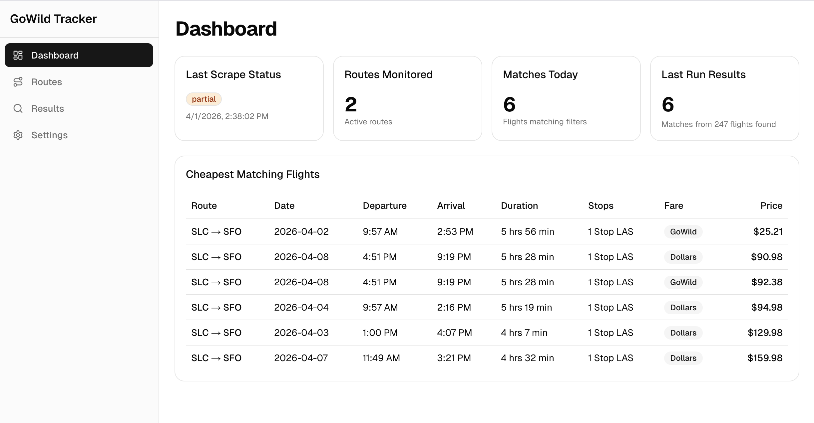
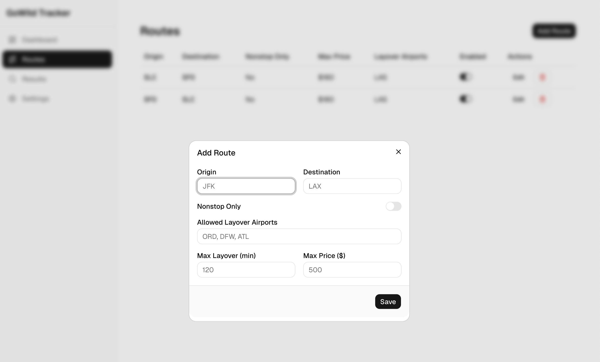

# GoWild Flight Tracker

Self-hosted flight tracker that monitors Frontier Airlines GoWild and Discount Den availability, filters by your criteria, and sends email alerts.





## Prerequisites

- **macOS** (tested on Mac Mini M1)
- **[Homebrew](https://brew.sh)** — `/bin/bash -c "$(curl -fsSL https://raw.githubusercontent.com/Homebrew/install/HEAD/install.sh)"`
- **[Node.js](https://nodejs.org)** 20+ — `brew install node`
- **[CrawlByte](https://crawlbyte.ai)** API key — sign up at [dash.crawlbyte.ai](https://dash.crawlbyte.ai)

The setup script auto-installs `jq` and `pm2` if missing.

## Quick Start

```bash
git clone <repo-url> gowild
cd gowild
./setup.sh
```

The setup script walks you through:
1. Installs npm dependencies
2. Prompts for Gmail credentials (saved to `.env`)
3. Sets up the SQLite database
4. Builds the Next.js app
5. Optionally sets up Cloudflare Tunnel for public access
6. Starts the app with pm2

**Note:** You need a CrawlByte API key for the scraper to work. Add it to `.env` as `CRAWLBYTE_API_KEY`.

## Manual Start

```bash
./start.sh          # Run with Ctrl-C support
# or
pm2 start ecosystem.config.js
```

### Persist across reboots

The setup script offers to configure this, but if you need to do it manually:

```bash
pm2 start ecosystem.config.js
pm2 save
pm2 startup          # prints a sudo command — copy and run it
```

The `pm2 startup` command creates a launchd service so your pm2 processes restart automatically when the Mac reboots.

## Configuration

All config is in `.env` (created from `.env.example` during setup):

| Variable | Description |
|----------|-------------|
| `DATABASE_URL` | SQLite database path (default: `file:./prisma/gowild.db`) |
| `GMAIL_USER` | Gmail address for sending notifications |
| `GMAIL_APP_PASSWORD` | Gmail app password ([how to create one](#gmail-app-password)) |
| `TZ` | Timezone (default: `America/Los_Angeles`) |
| `BASE_URL` | App URL for email links (default: `http://localhost:3000`) |
| `CRAWLBYTE_API_KEY` | [CrawlByte](https://crawlbyte.ai) API key for flight data scraping |
| `CF_API_TOKEN` | Cloudflare API token (optional, for public access) |
| `CF_ACCOUNT_ID` | Cloudflare account ID |
| `CF_ZONE_ID` | Cloudflare zone ID |
| `CF_DOMAIN` | Your domain (e.g., `example.com`) |
| `CF_SUBDOMAIN` | Subdomain for the tracker (default: `gowild`) |
| `CF_ACCESS_EMAIL` | Email allowed through Zero Trust Access |

## Gmail App Password

1. Go to [myaccount.google.com/security](https://myaccount.google.com/security)
2. Enable **2-Step Verification** if not already enabled
3. Go to [myaccount.google.com/apppasswords](https://myaccount.google.com/apppasswords)
4. Enter a name (e.g., "GoWild Tracker"), click **Create**
5. Copy the 16-character password (remove spaces)

## Cloudflare Tunnel Setup

Optional — only needed to access the tracker from outside your home network.

### 1. Add your domain to Cloudflare

If not already done, add your domain at [dash.cloudflare.com](https://dash.cloudflare.com) and update your registrar's nameservers to Cloudflare's.

### 2. Create an API token

Go to [dash.cloudflare.com/profile/api-tokens](https://dash.cloudflare.com/profile/api-tokens):

1. Click **Create Custom Token** > **Get started**
2. Add these 3 permissions:
   - **Account** > **Cloudflare Tunnel** > **Edit**
   - **Account** > **Access: Apps and Policies** > **Edit**
   - **Zone** > **DNS** > **Edit**
3. Under **Account Resources**, select **Include** > your account
4. Under **Zone Resources**, select **Include** > **Specific zone** > your domain
5. Click **Continue to summary** > **Create Token**
6. Copy the token immediately (only shown once)

### 3. Find your Account ID and Zone ID

Go to [dash.cloudflare.com](https://dash.cloudflare.com) > click your domain > **Overview**. Both IDs are in the right sidebar under **API**.

### 4. Run setup

Add `CF_*` values to `.env`, then run `./setup.sh`. The Cloudflare section will:
- Create a remotely-managed tunnel via API
- Configure public hostname ingress
- Create a DNS CNAME record
- Set up Zero Trust Access with email verification
- Install the tunnel as a system service (survives reboots)

## Architecture

- **Next.js** app with shadcn/ui admin interface
- **Prisma + SQLite** for data storage
- **node-cron** scheduler (4x/day with random jitter)
- **Nodemailer** for Gmail notifications
- **[CrawlByte](https://crawlbyte.ai)** API for flight data scraping (handles anti-bot evasion)
- **Cloudflare Tunnel** for secure public access (optional)

## Scripts

| Script | Description |
|--------|-------------|
| `./setup.sh` | Full interactive setup (deps, db, build, cloudflare, pm2) |
| `./start.sh` | Start the app with Ctrl-C support |
| `./test-tunnel.sh` | Test Cloudflare API tunnel creation (`--cleanup` to remove) |

## Development

```bash
npm run dev       # Start dev mode (hot reload, no scheduler)
npm run test      # Run tests in watch mode
npm run test:run  # Run tests once
npm run build     # Production build
npm start         # Start production server
```
